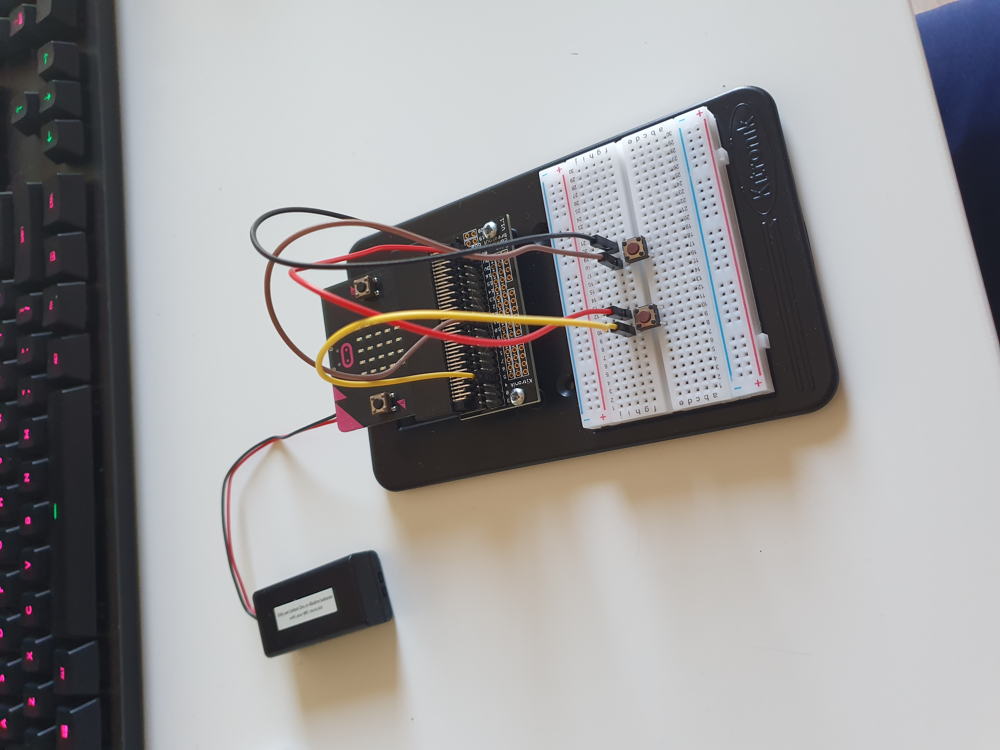
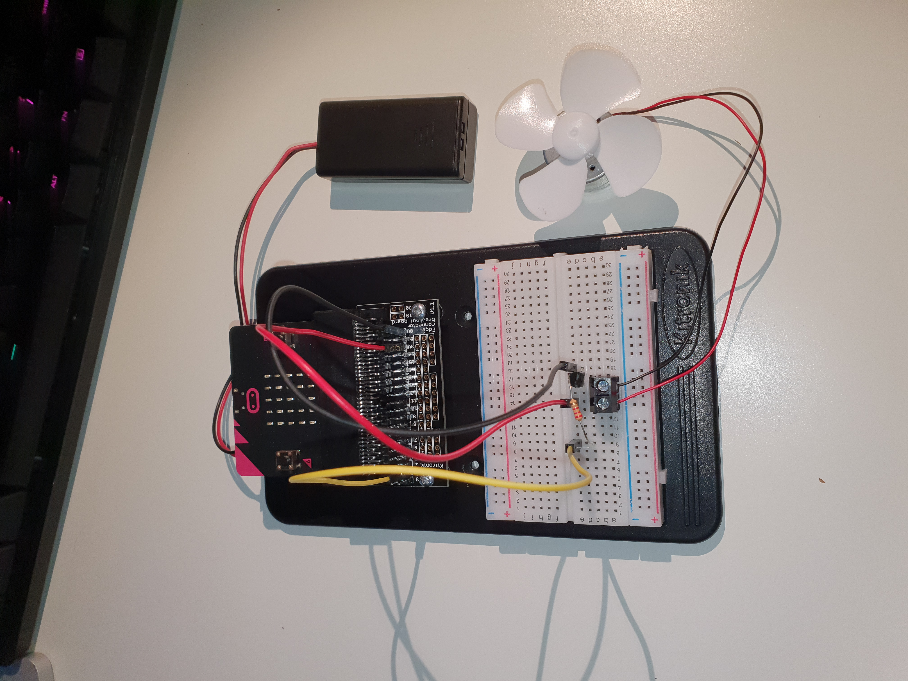
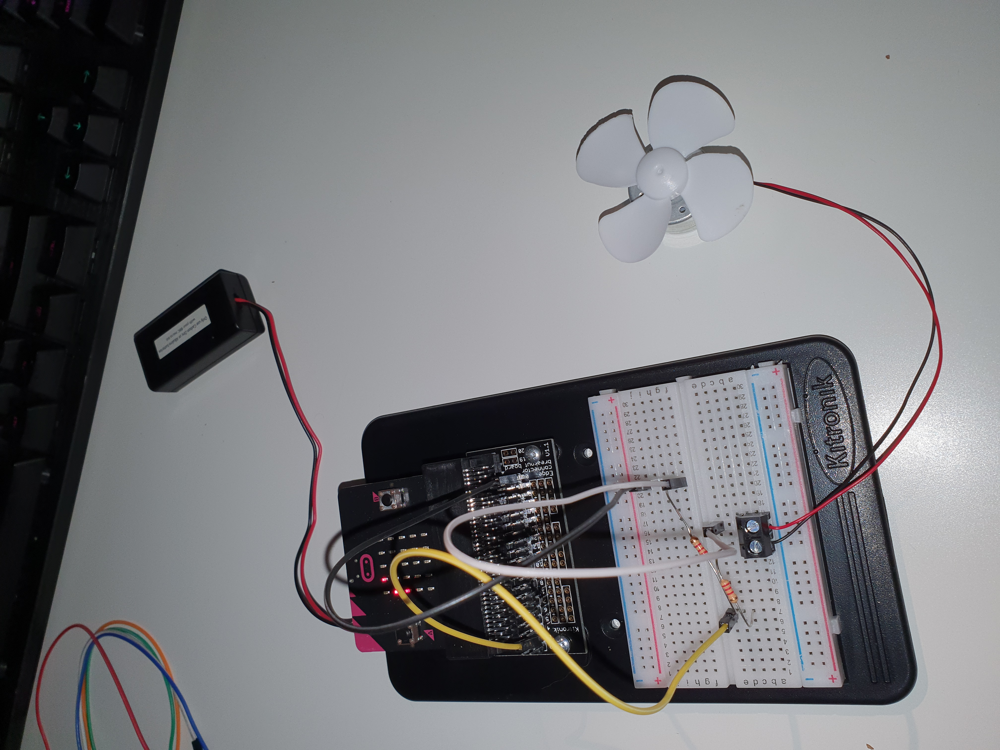
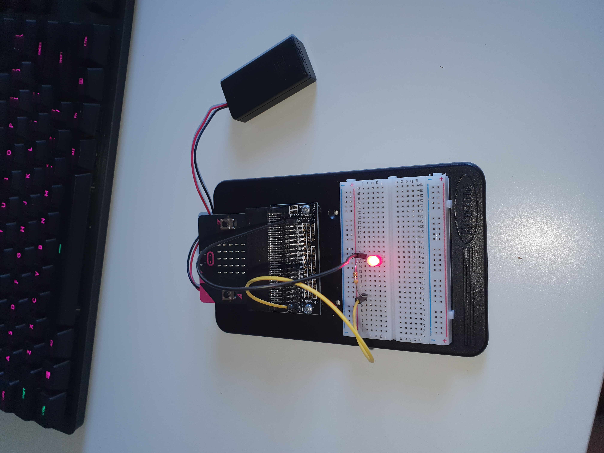

# Inventor Kit Experiments

*Markdown reference: https://guides.github.com/features/mastering-markdown/*

## Instructions ##

*For a selection of 5 inventor kit experiments that you choose, fill out the following sections.

### Experiment name ###

Say "HELLO" to the BBC mirco:bit

#### Photo of completed project ####

This is a picture of the first experiment I did using the inventor's kit.

#### Reflection ####

In this experiment, something new to me was using micro:bit, I've never used anything like it before so everything was new.

This experiment could be the basis of a real world application such as a customer satisfation button at a restaurant.

### Experiment name ###

Dimming an LED using a potentionmeter 

#### Photo of completed project ####
In the code below, replace imagemissing.jpg with the name of the image, which should be in the kitexperiments folder.

![Image]Experiment 3.jpg)

This is a picture of the third experiment I did using the inventor's kit.

#### Reflection ####

In this experiment, something I learned was how to use a potentionmeter to dim and lighten an LED light.

This experiment could be the basis of a real world application such as a light switch were you can adjust the brightness of it.

### Experiment name ###

Using a transistor to drive a motor

#### Photo of completed project ####
In the code below, replace imagemissing.jpg with the name of the image, which should be in the kitexperiments folder.

This is a picture of the fourth experiment I did using the inventor's kit.

#### Reflection ####

In this experiment, something I learned was that to power a motor you must use a terminal connector.

This experiment could be the basis of a real world application such as a fan which slowly turns on and off, instead of being on the whole time to save energy.

### Experiment name ###

Wind power 

#### Photo of completed project ####
In the code below, replace imagemissing.jpg with the name of the image, which should be in the kitexperiments folder.

This is a picture of the seventh experiment I did using the inventor's kit.

#### Reflection ####

In this experiment, something new to me was using the javascript code instead of the blocks.

This experiment could be the basis of a real world application such as wind turbine the measures the speed of the wind.

### Experiment name ###

Making a game using the compass

#### Photo of completed project ####
In the code below, replace imagemissing.jpg with the name of the image, which should be in the kitexperiments folder.

This is a picture of the eighth experiment I did using the inventor's kit.

#### Reflection ####

In this experiment, something I learned was that the BBC mirco:bit as a compass which can tell which way is north.

This experiment could be the basis of a real world application such as digital compass or a video game such as pokemon go.

