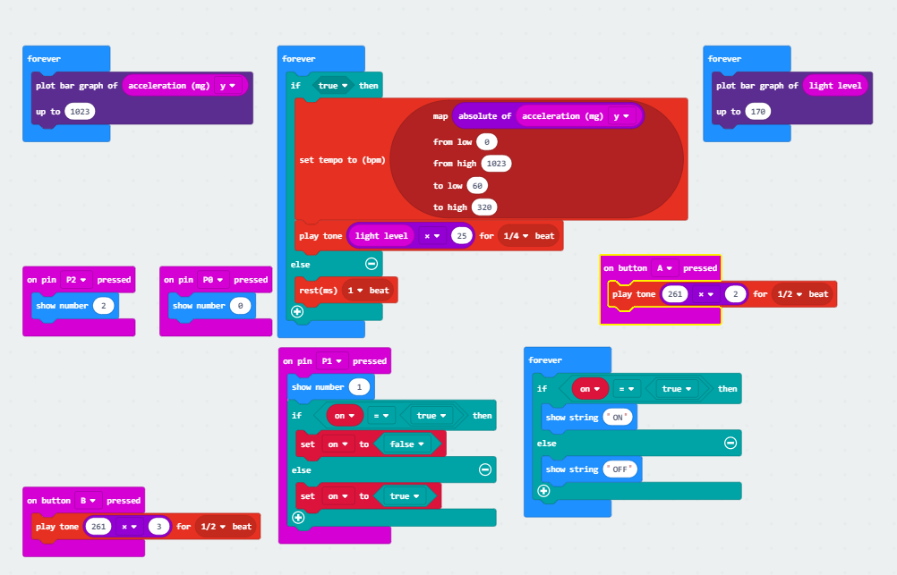

# Assessment 1: Replication project

*Fill out the following workbook with information relevant to your project.*

*Markdown reference:* [https://guides.github.com/features/mastering-markdown/](http://guides.github.com/features/mastering-markdown/)

## Replication project choice ##
Guitar

## Related projects ##
*Find about 6 related projects to the project you choose. A project might be related through  function, technology, materials, fabrication, concept, or code. Don't forget to place an image of the related project in the* `replicationproject` *folder and insert the filename in the appropriate places below. Copy the markdown block of code below for each project you are showing, updating the number* `1` *in the subtitle for each.*

### Related project 1 ###
Reaction game

https://www.youtube.com/watch?v=DgJ-S0q0EMs

This project is related to mine because of the matrials used and how the aluminum foil is used as some sort of interactive surface.

### Related project 2 ###
Interactive Proximity Sensing Table Modules

https://www.youtube.com/watch?v=h5n0rw8wo14&t=113s

This project is related to mine because it uses light to control the interaction.

### Related project 3 ###
Money robot

https://www.youtube.com/watch?v=Jskg6gfSGd8&t=27s

This project is related to mine because it uses cardboard.

### Related project 4 ###
Milk monster

https://www.youtube.com/watch?v=egl3fNAYylk

This project is related to mine because it functions the same, it reacts differently to the amount of light is exposed to the micro:bit.

### Related project 5 ###
Arduino electronic Compass

https://www.youtube.com/watch?v=w3Gz472O93s&t=966s

This project is related to mine because they the both use compass technology to function.

### Related project 6 ###
Roulette game

https://www.youtube.com/watch?v=eqJrQhxwZwU

This project is related to mine because they both use similar materials.

## Reading reflections ##
*Reflective reading is an important part of actually making your reading worthwhile. Don't just read the words to understand what they say: read to see how the ideas in the text fit with and potentially change your existing knowledge and maybe even conceptual frameworks. We assume you can basically figure out what the readings mean, but the more important process is to understand how that changes what you think, particularly in the context of your project.*

*For each of the assigned readings, answer the questions below.*

### Reading: Don Norman, The Design of Everyday Things, Chapter 1 (The Psychopathology of Everyday Things) ###

Before I read this text I believed signifiers won't as important in design as they are.

I learnt that signifiers are important in design because it allows whoever is interacting with an object understand what to do.

I would like to learn more about what makes a good or bad signifier.

In my project I must make sure the user understands what to do with it, therefore I must use signifiers.

### Reading: Chapter 1 of Dan Saffer, Microinteractions: Designing with Details, Chapter 1 ###

What I thought before reading the text was that Micro interactions were not as important in products and the text made be thin otherwise.

What I learnt after reading this text is that Micro interactions plays a vital role in user experience and it could be a reason some likes a product or not. 

What I would like to know more about is what makes a good Micro interaction?

projects or how ideas in the reading could be used to improve your project.*
The idea that the little details could dramtically improve a project beacuse I will make sure to focus knowning the impact it could have.

### Reading: Scott Sullivan, Prototyping Interactive Objects ###

What I thought before reading this text is that making theses projects you should be able to complete it on the first couple tries and should not take much work if you know what your doing.

What I learnet When working with theses types of projects it can take many tries to get something to work correctly and you have to be patient when doing so.

Arduino is somthing I found really interesting and I would like to learn more about how its works.

The ideas in this reading was that I might get the project working first try. This helps me understand that in order to successfully do something correctly it will take me many tries and I'll have to be patient.

## Interaction flowchart ##
*Draw a flowchart of the interaction process in your project. Make sure you think about all the stages of interaction step-by-step. Also make sure that you consider actions a user might take that aren't what you intend in an ideal use case. Insert an image of it below. It might just be a photo of a hand-drawn sketch, not a carefully drawn digital diagram. It just needs to be legible.*

## Process documentation

## Project outcome ##

### Cardboard guitar ###

### Project description ###

This project is a gutiar made out of cardboard and it uses a micro:bit and a speaker to create sound. What it does is the micro:bit was programmed to create sound and the user is able to intract with that sound by tipping the guitar or putting their hand over the micro:bit LED. This project is for anyone that want to feel like their playing a gutiar without having to spend lots of money. For example, it could be used by a small child.

### Showcase image ###

### Additional view ###

### Reflection ###

I feel like I was most successful in crafting the guitar, it wasn't anything new to me, the process was very straight forward. In the other hand coding the project was much more difficult for me since I've never done anything like this before. In some parts i found it hard to understand what  was going on with the code.

I used techniques of using cardboard as my main material. Many of the related projects I saw used cardboard. 

*What ideas have you read, heard, or seen that informed your thinking on this project? (Provide references.)*

An interesting extension of the project could be making other instruments. This could be used to make a song only using theses instruments. 
